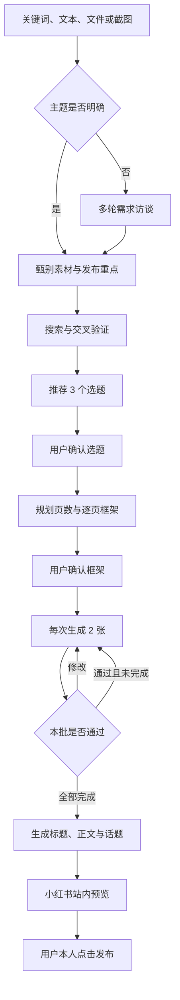

# 小红书 Skill

一个面向 **AI 产品经理新手**和 **AI 兴趣读者**的小红书图文创作 Skill。

它不只是把素材改写成笔记，而是从选题判断开始，依次完成需求访谈、资料核验、页面规划、分批出图、修改验收、发布文案和小红书站内预览。整体表达可爱、年轻、有故事感，知识结论保持严谨可信。

## 能做什么

- **没有选题时主动访谈**：通过多轮、每轮少量的问题，逐步确认方向、读者收益、素材、系列位置和表达边界。
- **甄别多模态素材**：支持关键词、长文本、文章、文件、截图或混合输入，先判断最值得发布的重点，不机械摘要。
- **先检索再创作**：优先使用论文、官方文档、标准和权威资料交叉验证；遇到一词多义时先向用户确认。
- **提供 3 个候选选题**：说明切角、读者收益、内容边界、建议页数和系列位置，等待用户选择。
- **逐级确认内容**：选题确认后再规划框架；框架确认后才开始出图。
- **每两张分批交付**：每批等待确认或修改，避免一次生成全部页面后大面积返工。
- **统一视觉系统**：采用 3:4 竖版、纯色手绘故事风格、固定角标和“小蓝”AI 怪兽 IP。
- **完成发布交接**：生成推荐标题、备选标题、200 字以内正文与话题，并在小红书站内生成发布预览。

> 安全边界：Skill 可以填写并展示发布预览，但最终的红色“发布”按钮始终由用户本人点击。

## 触发方式

以下表达会触发完整创作流程：

```text
我要写一篇小红书
我想写一篇小红书
写一篇小红书
```

也可以直接提供主题或素材：

```text
写一篇关于 RAG 的小红书
我有一篇文章和两张截图，帮我判断适合发什么
我没有想法，想做面向 AI 产品经理新手的系列内容
```

## 工作流



任何阶段都不会跨过尚未完成的确认节点。

## 内容标准

单篇内容会根据题目选择合适模块，重点覆盖：

- 它是什么
- 它属于哪个知识体系
- 为什么重要
- 解决什么真实问题
- 如何工作或如何使用
- 一个形象但不失真的例子
- AI 产品经理需要关注的条件、指标与风险
- 与下一篇内容的关联

每篇最终交付包括：

- 选题结论与核验依据
- 已确认的页数和逐页框架
- 至少 4 张、按顺序编号的 3:4 成图
- 1 个推荐标题和 2 个备选标题
- 不超过 200 字的正文与 3–5 个话题建议
- 小红书站内预览或清晰的发布交接状态

## 视觉规范

- 画布：`1080 × 1440 px`，3:4 竖版
- 页数：至少 4 张，第 1 张固定为封面
- 风格：浅色纸张质感、蓝色为主、少量粉黄点缀的纯色手绘故事风
- 固定角标：`2026`、`Tang`、`AI`、`{{关键词}}`
- 关键词角标：不超过 4 个字符
- 封面：大标题居中，关键词加粗放大，导读紧跟标题下方
- 正文：黑色正文建议不小于 42 px，逻辑关系必须用文字、标签和箭头明确表达
- 固定 IP：软萌、精致、具有 AI 属性的小怪兽“小蓝”；角色只辅助理解，不代替知识逻辑

## 安装

将仓库克隆到 Codex 的 Skills 目录：

```bash
git clone https://github.com/mackcha1937/xiaohongshu-skill.git ~/.codex/skills/xiaohongshu-skill
```

安装后重新开启一个 Codex 任务，即可通过上面的触发表达使用。

也可以下载仓库 ZIP，解压后把文件夹放到：

```text
~/.codex/skills/xiaohongshu-skill
```

## 图片集校验

仓库提供了一个不依赖第三方包的校验脚本，用于检查图片数量、命名顺序、分辨率和 3:4 比例：

```bash
python3 scripts/validate_image_set.py "/absolute/path/to/final-images" --keyword "ANN"
```

默认要求：

- 至少 4 张 PNG/JPEG 图片
- 文件名从 `01` 开始连续编号
- 分辨率不低于 `720 × 960`
- 图片比例严格为 3:4
- `--keyword` 不超过 4 个字符

## 目录结构

```text
xiaohongshu-skill/
├── SKILL.md
├── agents/
│   └── openai.yaml
├── references/
│   ├── content-research.md
│   ├── publishing-handoff.md
│   └── visual-system.md
└── scripts/
    └── validate_image_set.py
```

- `SKILL.md`：核心触发条件和强制确认工作流
- `agents/openai.yaml`：Skill 在 Codex 中的展示信息和默认提示
- `references/content-research.md`：访谈、选题、检索、脚本与文案规范
- `references/visual-system.md`：画布、字体、小蓝 IP、关系图和视觉验收规范
- `references/publishing-handoff.md`：登录、上传、站内预览与人工发布边界
- `scripts/validate_image_set.py`：最终图片集的确定性校验工具

## 设计原则

1. **选题先于改写**：用户提供的材料是输入，不等于最终主题。
2. **确认先于执行**：先确认选题，再确认框架，之后每两张验收一次。
3. **正确先于好看**：故事、角色和类比都必须服务于正确的知识关系。
4. **可读先于堆砌**：优先保证手机端字号、边距和逻辑层级。
5. **预览先于发布**：站内信息填写完成后交给用户检查，最终发布由用户本人完成。
